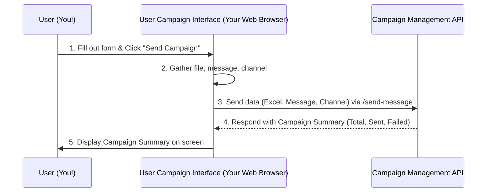

# Chapter 1: User Campaign Interface

Welcome to the very first chapter of our `sms-poc` tutorial! We're going to start our journey by looking at the most visible part of our project: the "User Campaign Interface." Think of it as the friendly control panel you'd use to send messages.

### What Problem Are We Solving?

Imagine you need to send an important announcement to a large group of people – maybe an update to all your customers, or an event reminder to attendees. Doing this one by one would be impossible! You need a simple way to:

1.  Gather all your contacts.
2.  Write a single message.
3.  Send that message to everyone on your list, all at once!

This is exactly the problem our User Campaign Interface solves. It's the "face" of our system, making the complex process of sending bulk messages feel easy and intuitive.

### Our Mission: Sending a Bulk SMS Campaign

Our goal in this chapter is to understand how you, as a user, would use this interface to send a bulk SMS campaign. We'll explore the dashboard, see what options it gives you, and understand what happens when you click that "Send" button.

### Meet Your Dashboard: The User Campaign Interface

The User Campaign Interface is a simple web page that appears in your browser. It's designed to be straightforward, like a car's dashboard, giving you exactly what you need without overwhelming you.

Here's a peek at what it looks like (from `frontend\index.html`):

```html
<!DOCTYPE html>
<html lang="en">
<body>
    <div class="container">
        <h1>Bulk Campaign Tool</h1>
        <form method="post">
            <label>Upload Excel</label>
            <input type="file" id="excel" accept=".xlsx">
            <label>Message</label>
            <textarea id="message" placeholder="Enter your message"></textarea>
            <label>Channel</label>
            <select id="channel">...</select>
            <button type="submit" id="sendBtn">
                Send Campaign
            </button>
        </form>
        <h3>Campaign Status</h3>
        <div id="status" class="status"></div>
    </div>
    <script src="script.js"></script>
</body>
</html>
```

This HTML code is the blueprint for our dashboard. Let's break down its key elements:

1.  **File Upload (`<input type="file">`):** This is where you'll select your Excel file containing all the contact numbers.
2.  **Message Area (`<textarea>`):** Here, you type out the message you want to send to everyone.
3.  **Channel Selector (`<select>`):** This dropdown lets you choose *how* you want to send the message (SMS, WhatsApp, or both!).
4.  **Send Button (`<button>`):** The big button that kicks off your campaign.
5.  **Campaign Status (`<div id="status">`):** After your campaign runs, this area will magically update to show you a summary (how many messages were sent successfully, and how many failed).

Our `style.css` file makes all these elements look neat and organized, giving them a pleasant visual appearance, but for this chapter, we'll focus on the functionality.

### How to Send Your First Campaign

Using the interface is simple:

1.  **Open the web page:** In your browser, you'd navigate to where this interface is hosted (e.g., `http://localhost:3000`).
2.  **Upload your contacts:** Click the "Upload Excel" button and choose your Excel file. This file should contain a list of phone numbers.
3.  **Type your message:** Write your desired message in the "Message" text area.
4.  **Choose your channel:** Select "SMS," "WhatsApp," or "Both" from the dropdown.
5.  **Click "Send Campaign":** This is the magic button that starts everything!

Once you click "Send Campaign," the interface will wait for a response and then update the "Campaign Status" section to show you the results. For example:

```
Total Contacts: 100
Messages Sent: 95
Messages Failed: 5
```

### What Happens When You Click "Send Campaign"? (Under the Hood - Part 1)

When you click the "Send Campaign" button, the web page doesn't just *do* something by itself. It needs to talk to a server (another computer program running somewhere) to actually process your request. This communication happens using some JavaScript code in `frontend\script.js`.

Let's look at the crucial parts of `script.js`:

```javascript
// frontend\script.js
const btn = document.getElementById('sendBtn');
btn.addEventListener('click', sendMessage); // 1. When button is clicked, run sendMessage()

function sendMessage(e) {
    e.preventDefault(); // Stop the form from doing its default submit
    const file = document.getElementById('excel').files[0]; // 2. Get the uploaded file
    const message = document.getElementById('message').value; // 3. Get the message text
    const channel = document.getElementById('channel').value; // 4. Get the selected channel
    const status = document.getElementById('status'); // Get the status area

    const formData = new FormData(); // 5. Prepare data to send
    if (!file) {
        alert('Please choose an Excel file first.');
        return;
    }
    formData.append('file', file);
    formData.append('message', message);
    formData.append('channel', channel);

    // ... (rest of the code to send data to server)
}
```

Here's a step-by-step breakdown of what the `sendMessage` function does:

1.  **Listens for Clicks:** The line `btn.addEventListener('click', sendMessage);` tells the browser: "Hey, whenever someone clicks the 'Send Campaign' button, run the `sendMessage` function!"
2.  **Gathers Input:** Inside `sendMessage`, it first grabs all the information you provided: your uploaded Excel file, the message you typed, and the channel you selected.
3.  **Packages the Data:** It then creates a `FormData` object. Think of `FormData` as a digital package or envelope. It puts your file, message, and channel choice into this package.

### How the Interface Talks to the System

Now, how does this "package" get from your browser to the part of our system that actually sends messages? It sends it to our server using a network request.

Here's the next piece of the `sendMessage` function:

```javascript
// frontend\script.js (continued from sendMessage function)

    // ... (formData preparation)

    let res = fetch('http://localhost:4000/send-message', { // 6. Send the package to the server!
        method: 'POST', // This tells the server we're 'posting' new data
        body: formData  // Here's our package of data
    })
    .then(response => response.json()) // 7. Once server responds, read its message
    .then(data => {
        console.log(data);
        status.innerHTML = ` // 8. Display the results from the server
            <p>Total Contacts: ${data.total}</p>
            <p>Messages Sent: ${data.sent}</p>
            <p>Messages Failed: ${data.failed}</p>
        `;
    });
}
```

This part is crucial:

6.  **Sending the Package (`fetch`):** The `fetch` command is like sending a letter. It directs the `formData` package to `http://localhost:4000/send-message`. This `http://localhost:4000/send-message` is the address of our server's [Campaign Management API](02_campaign_management_api_.md), which is responsible for handling these requests.
7.  **Receiving a Response:** Once the server finishes processing (which involves many steps we'll cover in later chapters), it sends back a response. We use `.then(response => response.json())` to read this response, which usually contains a summary of the campaign.
8.  **Displaying the Status:** Finally, `.then(data => { ... })` takes the server's summary (like `data.total`, `data.sent`, `data.failed`) and updates the `status` div on our web page, so you can see the results!

Here's a simple diagram to visualize this interaction:



This diagram shows the basic flow: you interact with the browser, the browser talks to the server, and the server talks back to the browser, which then shows you the results.

### Conclusion

In this chapter, we've explored the "User Campaign Interface" – the friendly face of our `sms-poc` project. You've learned:

*   It's a web-based dashboard for initiating bulk SMS campaigns.
*   It provides simple controls for uploading contacts, typing messages, and sending.
*   It displays a summary of your campaign's success.
*   Under the hood, your browser gathers information from the form and uses JavaScript's `fetch` command to send this data to our server's [Campaign Management API](02_campaign_management_api_.md).

This interface is just the starting point! The real work of processing your contacts and sending messages happens on the server side. In the next chapter, we'll dive into how the server receives and manages these requests through the [Campaign Management API](02_campaign_management_api_.md).

---
