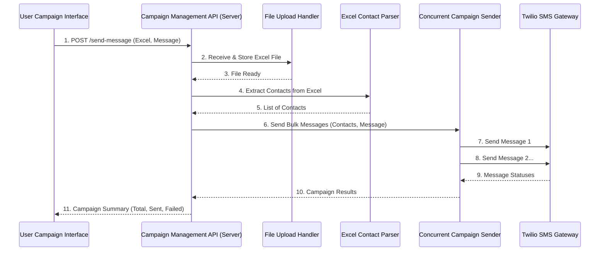

# Chapter 2: Campaign Management API

Welcome back! In [Chapter 1: User Campaign Interface](01_user_campaign_interface_.md), we learned how you, as a user, interact with our `sms-poc` project's web page to prepare and send a bulk message campaign. You clicked the "Send Campaign" button, and we saw how the browser bundles your Excel file and message and sends them off to our server.

But what happens *after* the browser sends that package? Where does it go? That's exactly what we'll explore in this chapter: the **Campaign Management API**.

### What Problem Are We Solving? The Backend's Control Center

Imagine sending a huge pizza order to a restaurant. You tell the person taking your order (the User Campaign Interface) what you want. But that person doesn't make the pizza themselves, right? They pass your order to the kitchen manager. The kitchen manager then tells the chef to prepare the dough, another person to add toppings, and a third to put it in the oven. Finally, someone delivers it, and the manager reports back if everything went well.

The **Campaign Management API** is just like that kitchen manager. It's the server's central control point, its brain, that receives your campaign request and makes sure all the different parts of the backend system work together to actually send your messages.

It solves the problem of coordinating a complex process: from receiving a file, to extracting contacts, to sending messages, and finally reporting the outcome.

### Our Mission: Understanding the `/send-message` Entrance

Our goal in this chapter is to understand how the Campaign Management API receives your campaign request and acts as the orchestrator for the entire message-sending process. We'll look at the specific "door" it uses to receive requests and what steps it takes to manage the campaign.

### The `/send-message` API Endpoint: The Server's Front Door

When the frontend (your browser) sends your campaign data, it sends it to a specific address on our server: `http://localhost:4000/send-message`. This `/send-message` part is called an **API endpoint**. Think of it as a specific delivery point or a labeled mailbox at the server's address.

The Campaign Management API is primarily defined by how it handles requests to this `/send-message` endpoint. It's the place where your instructions (Excel file, message) arrive.

### How the Campaign Management API Orchestrates a Campaign

Once your campaign data arrives at the `/send-message` endpoint, the Campaign Management API springs into action. It doesn't do *all* the work itself, but it knows who to call and what order to call them in. It's like a project manager following a checklist:

1.  **Receive Your Package**: It first makes sure it has received your Excel file and your message correctly.
2.  **Read Contacts**: It hands over the Excel file to another specialist part of the system (the [Excel Contact Parser](04_excel_contact_parser_.md)) to read all the phone numbers and names.
3.  **Prepare for Sending**: It then takes this list of contacts and your message and passes them to another dedicated component (the [Concurrent Campaign Sender](05_concurrent_campaign_sender_.md)) which is designed to send messages efficiently.
4.  **Invoke SMS Gateway**: The sender component then talks to external services like the [Twilio SMS Gateway](06_twilio_sms_gateway_.md) to actually deliver the messages.
5.  **Manage Many Sends**: It makes sure that even if you have hundreds or thousands of contacts, messages are sent in an organized way, without overwhelming the system.
6.  **Compile Results**: As messages are sent (or fail to send), it keeps track of everything.
7.  **Report Back**: Finally, it gathers all the success and failure information and sends a summary back to your browser so you can see the results on the "Campaign Status" section.

### Visualizing the Orchestration

Let's look at a simplified diagram to see how the Campaign Management API (our server) interacts with other parts of the system when you click "Send Campaign":



In this diagram, the Campaign Management API (labeled `C_API` on the server) is at the center. It receives the request and then delegates tasks to `F_Uploader` (our [File Upload Handling](03_file_upload_handling_.md)), `E_Parser` (our [Excel Contact Parser](04_excel_contact_parser_.md)), and `C_Sender` (our [Concurrent Campaign Sender](05_concurrent_campaign_sender_.md)), which then talks to the `T_Gateway` (our [Twilio SMS Gateway](06_twilio_sms_gateway_.md)).

### Digging into the Code: `backend\server.js`

Now, let's peek at the actual code that implements this "kitchen manager" role. All of this logic resides in our `backend\server.js` file.

The core of the Campaign Management API is how it handles the `POST` request to the `/send-message` endpoint.

```javascript
// backend\server.js

// ... (other setup code) ...

app.post('/send-message', upload.single('file'), async (req, res, next) => {
    try {
        // ... (API logic goes here) ...
    } catch (error) {
        next(error); // Handle any errors that occur
    }
});

// ... (other code) ...
```

This code snippet shows the main "entrance" point.
*   `app.post('/send-message', ...)`: This tells our server, "When you receive a POST request at `/send-message`, run the following function."
*   `upload.single('file')`: This is a special helper that takes care of receiving the uploaded Excel file. We'll learn more about this in [Chapter 3: File Upload Handling](03_file_upload_handling_.md).
*   `async (req, res, next) => { ... }`: This is the function that contains all the orchestration logic. `req` holds the incoming request (like your Excel file and message), `res` is what we use to send a response back to the browser, and `next` is for error handling.

Let's break down the steps inside this function:

#### Step 1: Check for the Uploaded File and Message

The first thing the API does is ensure it actually received the file and message from the user.

```javascript
// backend\server.js (inside app.post('/send-message'))

        if (!req.file) {
            return res.status(400).json({
                message: 'Please upload an Excel file.'
            });
        }

        const messageBody = String(req.body.message || DEFAULT_MESSAGE).trim();

        if (!messageBody) {
            return res.status(400).json({
                message: 'Message body cannot be empty.'
            });
        }
```

*   `if (!req.file)`: If `req.file` is empty, it means no Excel file was uploaded. The API immediately sends back an error message (`res.status(400).json(...)`) to the browser.
*   `const messageBody = ...`: It safely extracts the message text that you typed into the frontend.
*   `if (!messageBody)`: Similarly, it checks if the message is empty and sends an error if it is.

#### Step 2: Read Contacts from the Excel File

Once the file and message are validated, the API calls upon our [Excel Contact Parser](04_excel_contact_parser_.md) to get the list of contacts.

```javascript
// backend\server.js (inside app.post('/send-message'))

        const users = readContactsFromBuffer(req.file.buffer);
```

*   `readContactsFromBuffer(req.file.buffer)`: This line is where the magic of reading the Excel file happens. The API simply passes the raw Excel data (`req.file.buffer`) to the `readContactsFromBuffer` function. It doesn't need to know *how* that function works, only that it will return a list of `users` (contacts). We will explore `readContactsFromBuffer` in detail in [Chapter 4: Excel Contact Parser](04_excel_contact_parser_.md).

#### Step 3: Send Bulk Messages and Collect Results

With the list of contacts ready, the API then instructs the [Concurrent Campaign Sender](05_concurrent_campaign_sender_.md) to start sending messages.

```javascript
// backend\server.js (inside app.post('/send-message'))

        const results = await sendBulkMessages(users, messageBody);
```

*   `await sendBulkMessages(users, messageBody)`: This line calls the `sendBulkMessages` function, passing it the list of `users` and the `messageBody`. The `await` keyword means the API will pause here and wait for all the messages to be sent and for `sendBulkMessages` to return its `results`. We will learn all about `sendBulkMessages` in [Chapter 5: Concurrent Campaign Sender](05_campaign_sender.md).

#### Step 4: Compile and Report Campaign Summary

Finally, after all messages have been processed, the API collects the results and sends a summary back to the browser.

```javascript
// backend\server.js (inside app.post('/send-message'))

        const sentCount = results.filter(result => result.sid).length;
        const failedCount = results.length - sentCount;

        return res.json({
            message: `Campaign processed for ${results.length} contact(s).`,
            total: results.length,
            sent: sentCount,
            failed: failedCount,
            results // (Full detailed results are also included, but for now we focus on summary)
        });
```

*   `sentCount` and `failedCount`: These lines quickly count how many messages were successfully sent (`result.sid` means it got a message ID from Twilio) and how many failed.
*   `return res.json(...)`: This sends a JSON (JavaScript Object Notation) response back to the browser. This `json` contains the `total`, `sent`, and `failed` counts, which the frontend then displays in the "Campaign Status" area (as you saw in Chapter 1).

### Conclusion

In this chapter, we've explored the **Campaign Management API**, the central control unit of our `sms-poc` project. You've learned:

*   It acts as the server's control center, receiving campaign requests from the frontend at the `/send-message` endpoint.
*   It orchestrates the entire backend process, delegating tasks like file handling, contact parsing, and message sending to specialized components.
*   It gathers results from these components and reports a campaign summary back to the user interface.

This API is crucial because it ties together all the different parts of our backend system. Now that we understand its role in managing the overall campaign flow, we can start looking at the specific tasks it delegates. Next up, we'll dive into how the server handles the Excel file you upload in [Chapter 3: File Upload Handling](03_file_upload_handling_.md).

---
