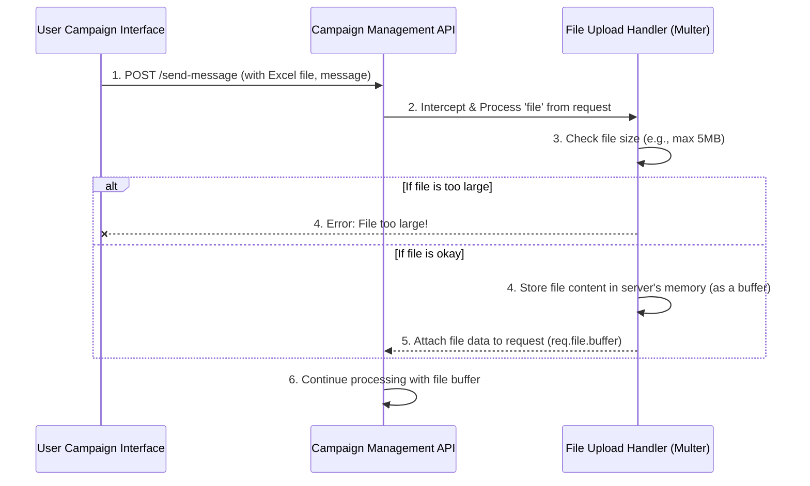

# Chapter 3: File Upload Handling

Welcome back! In our previous chapter, [Chapter 2: Campaign Management API](02_campaign_management_api_.md), we learned that the Campaign Management API acts as the central orchestrator for our SMS campaigns. It receives your request and then delegates tasks to various specialized components. One of the very first tasks it needs to handle is receiving the Excel file you uploaded from your browser.

But how exactly does the server *receive* that file? How does it ensure the file isn't too big, or that it's correctly prepared for the next step? This is where **File Upload Handling** comes in.

### What Problem Are We Solving? The Server's Receiving Dock

Imagine our server as a busy warehouse. When you upload an Excel file from your computer, it's like sending a package to that warehouse. You can't just throw packages anywhere; there needs to be a dedicated **receiving dock** specifically designed to handle incoming deliveries.

The "File Upload Handling" part of our `sms-poc` project is precisely this receiving dock. It's responsible for:

1.  **Safely accepting** the Excel file you send from your browser.
2.  **Performing quick checks**, like making sure the file isn't too large (we don't want someone sending a giant file and crashing our server!).
3.  **Correctly processing** the file so its contents are ready for the next step, which is usually reading the contacts.

This component ensures that the raw file data is properly captured and available in a usable format for other parts of our system, like the [Excel Contact Parser](04_excel_contact_parser_.md).

### Our Mission: Understanding How Your Excel File Arrives Safely

Our goal in this chapter is to understand the journey of your Excel file from your browser to our server. We'll explore how our server is set up to receive this file, apply necessary checks, and prepare its content for further processing.

### The Tool for the Job: `Multer`

To build our "receiving dock" for files, we use a special tool called `multer`. `Multer` is a popular JavaScript library that makes handling file uploads in web applications much easier. Think of `multer` as the specialized equipment and trained staff at our receiving dock—it knows exactly how to deal with incoming packages (files).

### How File Upload Handling Works (The Big Picture)

Let's visualize how `multer` fits into the picture when you upload your Excel file:



Here's what's happening:

1.  When you click "Send Campaign" in your browser, the [User Campaign Interface](01_user_campaign_interface_.md) sends a `POST` request to our server's `/send-message` address. This request includes your Excel file and message.
2.  The `Campaign Management API` (our server) is set up so that before it even starts its main processing, it hands over the file part of the request to our `Multer` "File Upload Handler."
3.  `Multer` immediately performs checks, like the file size limit.
4.  If the file is too large, `multer` stops the process and sends an error back.
5.  If the file passes the checks, `multer` reads the entire Excel file into the server's temporary memory. It's like unwrapping the package and placing its contents (the file data) onto a special holding tray. This content is called a "buffer."
6.  Finally, `multer` makes this buffer easily accessible to the `Campaign Management API`, which can then pick it up and pass it to the [Excel Contact Parser](04_excel_contact_parser_.md).

### Diving into the Code: `backend\server.js`

Let's look at how we set up and use `multer` in our `backend\server.js` file.

#### Step 1: Importing and Configuring `Multer`

First, we need to bring the `multer` tool into our server program and tell it how we want our files handled.

```javascript
// backend\server.js

// ... (other imports) ...
const multer = require('multer'); // Bring in the Multer library
// ... (other constants) ...
const MAX_FILE_SIZE_BYTES = 5 * 1024 * 1024; // This sets our limit to 5 Megabytes (MB)

const upload = multer({
    storage: multer.memoryStorage(), // Store the file in memory
    limits: {
        fileSize: MAX_FILE_SIZE_BYTES // Enforce the 5MB file size limit
    }
});
// ... (rest of the code) ...
```

**Explanation:**
-   `const multer = require('multer');`: This line brings the `multer` library into our project. It's like buying the special "file handling machine" for our warehouse.
-   `MAX_FILE_SIZE_BYTES`: We define a constant for the maximum file size we'll accept, which is 5 Megabytes. This is our "maximum package weight" rule.
-   `const upload = multer({...});`: Here, we *configure* `multer`.
    -   `storage: multer.memoryStorage()`: This tells `multer` to store the incoming file directly in the server's temporary memory (RAM) instead of saving it to a disk. This is very efficient for files we'll process immediately and don't need to keep long-term.
    -   `limits: { fileSize: MAX_FILE_SIZE_BYTES }`: This is our important safety check! If an uploaded file is larger than 5MB, `multer` will automatically reject it and throw an error.

#### Step 2: Using `Multer` in Our API Endpoint

Now that `multer` is configured, we need to tell our `/send-message` API endpoint to use it for incoming files.

```javascript
// backend\server.js (inside app.post('/send-message'))

app.post('/send-message', upload.single('file'), async (req, res, next) => {
    try {
        if (!req.file) { // Check if an Excel file was actually uploaded
            return res.status(400).json({
                message: 'Please upload an Excel file.'
            });
        }
        // The uploaded file's content is now in req.file.buffer
        const users = readContactsFromBuffer(req.file.buffer);
        // ... rest of the API logic (send messages, etc.) ...
    } catch (error) {
        next(error); // Pass any errors (like file size limit) to our error handler
    }
});
```

**Explanation:**
-   `upload.single('file')`: This is the magic part! When a `POST` request comes to `/send-message`, `multer` (our `upload` configuration) will look for a single file attached to the request, and expects its name to be `'file'`. (Remember from [Chapter 1: User Campaign Interface](01_user_campaign_interface_.md) how the frontend uses `formData.append('file', file)`? That `file` matches this `'file'` here!)
-   If `multer` successfully processes the file:
    -   It attaches the file's information to the `req` (request) object.
    -   Crucially, the raw content of the Excel file is available as a `buffer` at `req.file.buffer`. This `buffer` is exactly what the [Excel Contact Parser](04_excel_contact_parser_.md) needs!
-   `if (!req.file)`: This line acts as a basic check. If, for some reason, `multer` didn't find or process a file, we send an error message back to the user.
-   `next(error)`: If `multer` encounters an issue (like the file being too large), it will throw an error. This `next(error)` makes sure that error is caught by our general error-handling mechanism.

#### Step 3: Handling File Size Errors Gracefully

When `multer` detects a file that's too big, it throws a specific error. We want our server to respond with a clear message, not just a generic error.

```javascript
// backend\server.js (at the very end, before app.listen)

app.use((error, _req, res, _next) => {
    // Check if the error is specifically about file size
    const statusCode = error.code === 'LIMIT_FILE_SIZE' ? 413 : 500;

    res.status(statusCode).json({
        message: error.code === 'LIMIT_FILE_SIZE'
            ? 'The uploaded file is too large. Max size is 5MB.' // User-friendly message for file size
            : error.message || 'Something went wrong while processing the request.'
    });
});
```

**Explanation:**
-   This is a special error-handling "middleware" in Express. It catches any errors that occur during request processing.
-   `error.code === 'LIMIT_FILE_SIZE'`: `multer` specifically tags errors related to file size limits with this code.
-   If it's a `LIMIT_FILE_SIZE` error, we set the HTTP status code to `413` (which means "Payload Too Large") and send a very clear message to the user: "The uploaded file is too large. Max size is 5MB."
-   Otherwise, it's a general server error.

### Conclusion

In this chapter, we've explored **File Upload Handling**, the crucial "receiving dock" for your Excel files. You've learned:

*   It's responsible for safely accepting files, checking their size, and making their content available.
*   We use the `multer` library to achieve this, configuring it to store files in memory and enforce a maximum file size.
*   `Multer` seamlessly integrates with our `/send-message` API endpoint, providing the raw file data as a `buffer` in `req.file.buffer`.
*   We've also implemented robust error handling to inform the user if their file is too large.

Now that our server can successfully receive your Excel file and make its content available as a buffer, the next logical step is to actually *read* the contact information from that buffer. In the next chapter, we'll dive into the [Excel Contact Parser](04_excel_contact_parser_.md) to see how we extract phone numbers and names from your uploaded spreadsheet.

---
