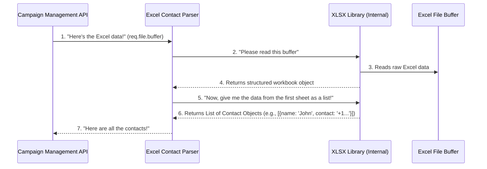

# Chapter 4: Excel Contact Parser

Welcome back! In our last chapter, [Chapter 3: File Upload Handling](03_file_upload_handling_.md), we learned how our server safely receives your Excel file, checking its size and making its raw content available as a "buffer" in its memory. Now that the file has arrived, the next crucial step is to understand what's *inside* that file.

But how do we read a spreadsheet full of names and numbers that's just a raw chunk of data in the computer's memory? This is where our **Excel Contact Parser** comes in!

### What Problem Are We Solving? Finding Contacts in a Spreadsheet

Imagine you have a big physical binder with hundreds of contact sheets, each filled with names and phone numbers. If someone just hands you the sealed binder, you first need to:

1.  Open the binder.
2.  Find the right section (a specific sheet).
3.  Read through the rows and columns to find the names and their corresponding phone numbers.
4.  Carefully write down each name and number on a separate slip of paper so they can be used for mailing.

This is exactly the problem the Excel Contact Parser solves for our `sms-poc` project. Its job is to efficiently:

1.  **Open** the uploaded Excel file (which is now a `buffer` in memory).
2.  **Locate** the contact data within its sheets.
3.  **Extract** all relevant details, specifically names and phone numbers.
4.  **Organize** these details into a structured list that our messaging system can easily use.

It turns a complex spreadsheet into a simple list of contacts, ready for action!

### Our Mission: Extracting Names and Numbers

Our goal in this chapter is to understand how our `sms-poc` project takes the raw Excel file data and intelligently pulls out all the individual contact details, making them ready for bulk messaging.

### The "Librarian" Tool: `XLSX` Library

To perform this meticulous parsing, our project uses a specialized JavaScript library called `xlsx`. Think of `xlsx` as our highly skilled digital librarian. It knows exactly how to navigate the complex structure of an Excel file, understand its sheets, rows, and columns, and then present the data to us in a clean, easy-to-use format.

### How the Excel Contact Parser Works (The Big Picture)

Let's visualize the flow of data as our Excel Contact Parser does its job:



Here's a step-by-step breakdown:

1.  The [Campaign Management API](02_campaign_management_api_.md) calls the Excel Contact Parser function, passing it the raw Excel data (`req.file.buffer`) that it received from the [File Upload Handling](03_file_upload_handling_.md) component.
2.  The Excel Contact Parser (our `readContactsFromBuffer` function) then uses the `xlsx` library to actually make sense of this raw data.
3.  The `xlsx` library reads the entire structure of the Excel file from the buffer and creates an internal "workbook" object, representing all the sheets, rows, and cells.
4.  It then takes the first sheet from this workbook and converts all its relevant data into a simple list of JavaScript objects. Each object in this list represents one contact (e.g., `{ NAME: 'John Doe', CONTACT: '+1234567890' }`).
5.  Finally, this structured list of contacts is returned to the [Campaign Management API](02_campaign_management_api_.md), which is now ready to send messages.

### Diving into the Code: `backend\server.js` (`readContactsFromBuffer` function)

All the magic of parsing happens inside a function called `readContactsFromBuffer` in our `backend\server.js` file. Let's look at it piece by piece.

First, we need to bring in the `xlsx` library at the top of our `backend\server.js` file:

```javascript
// backend\server.js

// ... (other imports) ...
const XLSX = require('xlsx'); // Bring in the XLSX library
// ... (rest of the code) ...
```
This line is like telling our program, "Hey, we're going to need that `XLSX` librarian to help us out!"

Now, let's look at the `readContactsFromBuffer` function itself:

```javascript
// backend\server.js

function readContactsFromBuffer(buffer) {
    // ... (logic to read and parse the Excel file) ...
}
```
This function takes one input: `buffer`, which is the raw Excel file data we received in the previous chapter. It's expected to return a list of contact objects.

#### Step 1: Opening the Excel File (from Buffer)

The first thing our parser does is open the Excel file data that's sitting in memory.

```javascript
// backend\server.js (inside readContactsFromBuffer)

    const workbook = XLSX.read(buffer, { type: 'buffer' });
```
-   `XLSX.read(buffer, { type: 'buffer' })`: This is the core command. It tells our `XLSX` librarian: "Please read this `buffer` (raw data) as if it were an Excel file."
-   `workbook`: The `XLSX` library then processes the buffer and returns a `workbook` object. This `workbook` object is a complete digital representation of your Excel file, including all its sheets, cells, and data.

#### Step 2: Finding the Right Sheet and Checking for Content

An Excel file can have multiple sheets. For simplicity, our parser assumes the contacts are in the *first* sheet. It also checks if the file and sheet actually contain data.

```javascript
// backend\server.js (inside readContactsFromBuffer)

    if (!workbook.SheetNames.length) {
        throw new Error('The uploaded Excel file does not contain any sheets.');
    }

    const sheetName = workbook.SheetNames[0]; // Get the name of the first sheet
    const rows = XLSX.utils.sheet_to_json(workbook.Sheets[sheetName], {
        defval: '' // If a cell is empty, use an empty string
    });

    if (!rows.length) {
        throw new Error('The uploaded Excel sheet does not contain any rows.');
    }
```
-   `if (!workbook.SheetNames.length)`: This checks if the workbook (Excel file) actually has any sheets inside it. If not, it's an invalid file, and we throw an error.
-   `const sheetName = workbook.SheetNames[0];`: Excel files have a list of sheet names (e.g., `['Sheet1', 'Contacts', 'Summary']`). We simply grab the name of the very first sheet in that list.
-   `XLSX.utils.sheet_to_json(...)`: This is another powerful `XLSX` command! It takes a specific sheet (`workbook.Sheets[sheetName]`) and converts *all* its data into a structured JavaScript array of objects.
    -   `defval: ''`: This is a helpful option. If an Excel cell is empty, `sheet_to_json` will use an empty string `''` instead of `undefined` for that property, making the data cleaner.
-   `if (!rows.length)`: After conversion, we check if the resulting `rows` array is empty. If the sheet had no actual data rows (just headers, for example), we throw an error.

#### Step 3: Understanding the Output Structure

What does `XLSX.utils.sheet_to_json` actually give us? It converts your Excel sheet into a format that's super easy for our program to use.

Imagine your Excel file looks like this:

| NAME       | CONTACT         | ADDRESS     |
| :--------- | :-------------- | :---------- |
| Alice      | +11234567890    | 123 Main St |
| Bob        | +19876543210    | 456 Oak Ave |
| Charlie    | +15551234567    |             |

The `sheet_to_json` function will convert this into an array of JavaScript objects, like this:

```json
[
  { "NAME": "Alice", "CONTACT": "+11234567890", "ADDRESS": "123 Main St" },
  { "NAME": "Bob", "CONTACT": "+19876543210", "ADDRESS": "456 Oak Ave" },
  { "NAME": "Charlie", "CONTACT": "+15551234567", "ADDRESS": "" }
]
```
Notice how the column headers (`NAME`, `CONTACT`, `ADDRESS`) become the "keys" (property names) in each object, and the row values become the "values." This format is perfect for our program to iterate through and pick out the `NAME` and `CONTACT` for each person.

#### Step 4: Returning the Contacts

Finally, the function returns this list of structured contacts:

```javascript
// backend\server.js (inside readContactsFromBuffer)

    return rows; // Return the array of contact objects
```
This `rows` array is the ultimate output of our Excel Contact Parser, containing all the names and phone numbers extracted from your uploaded file.

### How the Campaign Management API Uses the Parsed Contacts

Now that `readContactsFromBuffer` has done its job, the [Campaign Management API](02_campaign_management_api_.md) picks up this clean list of contacts. Remember this line from Chapter 2?

```javascript
// backend\server.js (inside app.post('/send-message'))

        const users = readContactsFromBuffer(req.file.buffer);
```
This is where the API calls our parser. The `users` variable will now hold that beautiful array of contact objects. The API can then easily loop through this `users` list and pass each contact's details (especially their `CONTACT` number) to the next component in our system: the one responsible for *sending* the actual messages!

### Conclusion

In this chapter, we've dissected the **Excel Contact Parser**, the "meticulous librarian" of our `sms-poc` project. You've learned:

*   It's responsible for extracting structured contact data (names and phone numbers) from raw Excel file content.
*   It uses the powerful `xlsx` library to read Excel buffers, access sheets, and convert data into an easy-to-use array of JavaScript objects.
*   It includes checks to ensure the uploaded Excel file actually contains sheets and data.
*   The output is a clear list of contacts, ready for the next stage of our campaign.

With our contacts now successfully parsed and ready, the next logical step is to actually *send* the messages. In the next chapter, we'll dive into the [Concurrent Campaign Sender](05_concurrent_campaign_sender_.md) to see how we efficiently send messages to all these extracted contacts.

---
