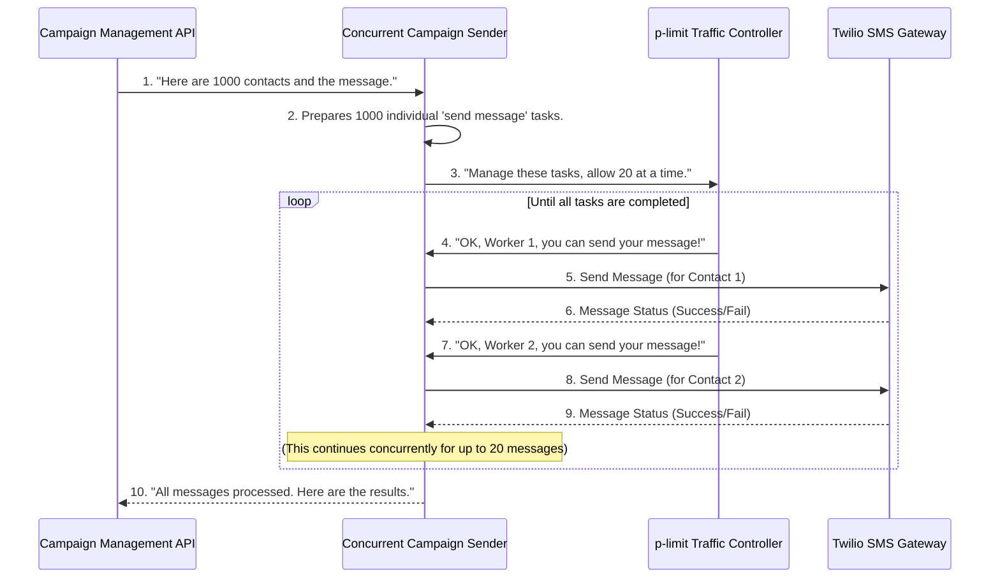

# Chapter 5: Concurrent Campaign Sender

Welcome back! In [Chapter 4: Excel Contact Parser](04_excel_contact_parser_.md), we successfully extracted all the contact details – names and phone numbers – from your uploaded Excel file. We now have a clean, organized list of people who need to receive your message.

But here's the challenge: what if you have a list of a *thousand* contacts? Or ten thousand? Sending a message to each one, one after another, would be incredibly slow. And if we try to send all of them at the exact same instant, we could overwhelm the external service that actually delivers the SMS (like our "post office," which is the Twilio API). That service might then get grumpy and tell us to slow down, or even block us, which is called "rate limiting."

This is exactly the problem our **Concurrent Campaign Sender** component solves!

### What Problem Are We Solving? Efficient and Controlled Bulk Sending

Think of our `sms-poc` system as a factory that makes and sends messages.

**The Problem:**
1.  **Speed:** You have a huge pile of messages (for all your contacts) that need to go out quickly. One worker sending messages one by one would take forever.
2.  **Overload:** If you hire hundreds of workers and tell them all to rush to the "post office" (Twilio) at the same time, the post office gets jammed. They can only handle so many packages (messages) per second. If you send too many, some packages get rejected or delayed.

**The Solution:**
We need an **efficient team manager** who can:
1.  Organize a small team of workers to send messages simultaneously (this is **concurrency**).
2.  Make sure this team sends messages in controlled batches, never sending more than the "post office" (Twilio API) can handle at once. This prevents "rate limiting" issues.
3.  Keep track of every message – whether it was sent successfully or if there was a problem.

The **Concurrent Campaign Sender** is this smart team manager. It ensures your bulk messages are sent out smoothly, reliably, and without overwhelming the messaging service.

### Our Mission: Sending Many Messages, But Not Too Many!

Our goal in this chapter is to understand how our `sms-poc` project takes that list of contacts and sends messages to them efficiently and in a controlled manner, making sure we respect the limits of the [Twilio SMS Gateway](06_twilio_sms_gateway_.md).

### The "Traffic Controller" Tool: `p-limit`

To manage our team of message senders and ensure they don't overwhelm the "post office," we use a special JavaScript tool called `p-limit`.

`p-limit` acts like a traffic controller. You tell it, "I only want X number of cars (messages) on the road (sending process) at any given time." It then creates X "slots" or "lanes." As soon as one car leaves a lane, another car waiting in line can enter. This way, we always have a steady flow of messages without ever exceeding our set limit.

### How the Concurrent Campaign Sender Orchestrates Messages

Let's visualize how the Concurrent Campaign Sender works as messages flow through it:



Here's a step-by-step breakdown of what happens:

1.  The [Campaign Management API](02_campaign_management_api_.md) calls the Concurrent Campaign Sender, giving it the list of all `users` (contacts) and the `messageBody` you want to send.
2.  The Concurrent Campaign Sender prepares a separate "task" for each contact – essentially, a mini-instruction to "send this message to this person."
3.  It hands all these tasks to the `p-limit` "Traffic Controller," telling it, "Only let a maximum number of tasks (e.g., 20) run at the same time."
4.  `p-limit` ensures that no more than 20 messages are actively being sent at any given moment. As soon as one message finishes, `p-limit` allows the next waiting message to start.
5.  Each individual message is then sent through the [Twilio SMS Gateway](06_twilio_sms_gateway_.md).
6.  The Concurrent Campaign Sender collects the results (success or failure) for every single message.
7.  Once `p-limit` confirms all tasks are done, the Concurrent Campaign Sender gives the complete `results` summary back to the [Campaign Management API](02_campaign_management_api_.md).

### Diving into the Code: `backend\server.js`

Let's look at the actual code that implements this "team manager" role in our `backend\server.js` file.

#### Step 1: Setting up the `p-limit` Traffic Controller

First, we need to bring in `p-limit` and configure our concurrency limit at the top of `backend\server.js`:

```javascript
// backend\server.js

// ... (other imports) ...
const pLimit = require('p-limit'); // Bring in the p-limit library
// ... (other constants) ...

// Set up our p-limit traffic controller:
const limit = pLimit(20); // This means only 20 tasks can run at the same time
```
-   `const pLimit = require('p-limit');`: This line brings the `p-limit` library into our project.
-   `const limit = pLimit(20);`: This is where we create our "traffic controller." We're telling it: "Allow a maximum of **20** tasks (which will be sending messages) to run concurrently." You can adjust this number based on your needs and the API limits of services like Twilio.

#### Step 2: The `sendOne` Function - Sending a Single Message

Before we can send many messages concurrently, we need a function that knows how to send *just one* message. This is handled by our `sendOne` function:

```javascript
// backend\server.js

async function sendOne(user, messageBody) {
    const name = user.NAME || 'Unknown';      // Get the name (or use 'Unknown')
    const rawContact = user.CONTACT;          // Get the phone number

    try {
        const message = await client.messages.create({ // Send message via Twilio
            body: messageBody,
            messagingServiceSid: SERVICE_SID,
            to: rawContact
        });
        // If successful, return details including Twilio's message ID (sid)
        return { name, contact: rawContact, sid: message.sid, status: message.status };
    } catch (error) {
        // If it fails, return details and the error message
        return { name, contact: rawContact, error: error.message };
    }
}
```
-   This `sendOne` function takes a single `user` object (which has `NAME` and `CONTACT` from our Excel file) and the `messageBody`.
-   `await client.messages.create(...)`: This is the crucial part where we actually talk to Twilio to send the SMS. We will explore this in detail in [Chapter 6: Twilio SMS Gateway](06_twilio_sms_gateway_.md).
-   It uses a `try...catch` block to gracefully handle any errors that might occur during sending (e.g., an invalid phone number).
-   It returns an object describing the outcome: either a `sid` (a unique ID from Twilio indicating success) and `status`, or an `error` message if something went wrong.

#### Step 3: The `sendBulkMessages` Function - Our Concurrent Manager

This is the core of our Concurrent Campaign Sender. It takes the entire list of users and uses `p-limit` to orchestrate the sending of individual messages.

```javascript
// backend\server.js

async function sendBulkMessages(users, messageBody) {
    // For demonstration, we'll only process a small sample of users.
    // In a real application, you'd process all users.
    const sample = users.slice(0, 50); // Processes only the first 50 contacts

    // Create a list of "promises" (future results) for each message
    const promises = sample.map(user =>
        // 'limit' ensures that sendOne is only called when a slot is free
        limit(() => sendOne(user, messageBody))
    );

    // Wait for ALL the messages (promises) to finish sending
    const results = await Promise.all(promises);

    return results; // Return the collected success/failure for each message
}
```
-   `const sample = users.slice(0, 50);`: For testing and demonstration, we often work with a smaller subset of data. This line takes only the first 50 contacts from your uploaded list. In a real-world scenario, you would remove this `slice` and process all `users`.
-   `sample.map(user => ...)`: This creates a new array. For *each* `user` in our `sample` list, we generate a "promise" (a placeholder for a future result) that represents the action of sending a message to that user.
-   `limit(() => sendOne(user, messageBody))`: This is where `p-limit` comes in! Instead of calling `sendOne` directly, we wrap it with `limit()`. This tells our "traffic controller": "Hey, here's a `sendOne` task. Only run it when one of your 20 slots is free."
-   `const results = await Promise.all(promises);`: After creating all these "limited" promises, `Promise.all` waits until *all* of them have completed (either successfully or with an error). Once they're all done, it collects all their individual results into a single `results` array.

#### Step 4: How the Campaign Management API calls the Sender

Let's quickly recall how the [Campaign Management API](02_campaign_management_api_.md) uses this `sendBulkMessages` function:

```javascript
// backend\server.js (inside app.post('/send-message'))

        // ... (file upload and message validation) ...
        const users = readContactsFromBuffer(req.file.buffer); // Contacts from Chapter 4
        // Call our Concurrent Campaign Sender!
        const results = await sendBulkMessages(users, messageBody);
        // ... (process results and send response back to frontend) ...
```
After the `users` list is ready (from `readContactsFromBuffer`), the API simply calls `sendBulkMessages` and `await`s its completion. Once the `results` are returned, the API can then calculate `sentCount` and `failedCount` to show the summary on the frontend.

### Conclusion

In this chapter, we've explored the **Concurrent Campaign Sender**, the "efficient team manager" of our `sms-poc` project. You've learned:

*   It solves the problem of sending a large number of messages quickly and reliably.
*   It uses the `p-limit` library as a "traffic controller" to send messages concurrently (many at once) but within a set limit, preventing rate limiting issues with external APIs.
*   The `sendOne` function handles the logic for sending a single message.
*   The `sendBulkMessages` function orchestrates all the `sendOne` calls using `p-limit` and `Promise.all` to manage the bulk sending process and collect results.

Now that we understand how our system efficiently manages sending many messages, the next logical step is to see how those individual messages actually get delivered to the outside world. In the next chapter, we'll dive into the [Twilio SMS Gateway](06_twilio_sms_gateway_.md) to see how we talk to an actual SMS provider.

---
