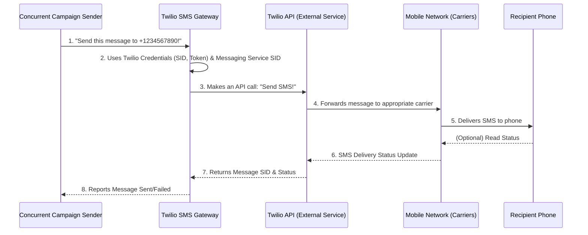

# Chapter 6: Twilio SMS Gateway

Welcome back! In our last chapter, [Chapter 5: Concurrent Campaign Sender](05_concurrent_campaign_sender_.md), we learned how to efficiently manage sending a large number of messages without overwhelming any external services. We prepared a list of contacts and knew *how* to process them in batches.

But there's still one missing piece: how do these messages actually leave our application and arrive on someone's phone? Our application isn't directly connected to the mobile phone networks of the world. We need a specialized service to act as our "SMS delivery person."

This is exactly what the **Twilio SMS Gateway** does for our `sms-poc` project!

### What Problem Are We Solving? The Message's Final Journey

Imagine our `sms-poc` application has written a letter (your message) and knows the address (the contact's phone number). We've even organized a system to efficiently get all the letters ready for delivery.

**The Problem:** Our application can't just magically teleport these letters to mailboxes (phones). It needs a reliable postal service, a third-party expert, to handle the actual delivery across different cities, countries, and mobile networks.

**The Solution:** The **Twilio SMS Gateway** is like our dedicated postal service for text messages. It's the core system that connects our application to the vast mobile network, allowing us to send SMS messages to many recipients using Twilio's powerful infrastructure. It takes our prepared message, uses special credentials, and then handles the actual transmission and status updates of each message.

It ensures that once our `sms-poc` app says "Send this SMS!", Twilio takes care of getting it to the right phone.

### Our Mission: Sending Real SMS Messages through Twilio

Our goal in this chapter is to understand how our `sms-poc` project talks to Twilio to send an actual SMS. We'll explore the necessary setup and the specific code that tells Twilio to deliver your message.

### The "Postal Service": Twilio

Twilio is a leading cloud communications platform. Think of them as a massive, global postal service specifically for digital messages like SMS, WhatsApp, and even voice calls. They have the infrastructure and agreements with mobile carriers worldwide to ensure your messages reach their destination.

To use Twilio, our application needs a few things:

1.  **Twilio Account:** You need an account with Twilio (like having an account with a postal service).
2.  **Account Credentials:** These are your unique "login details" for your Twilio account:
    *   **Account SID (System Identifier):** A unique ID for your Twilio account.
    *   **Auth Token (Authentication Token):** A secret key that proves you're allowed to use your account.
3.  **Messaging Service SID:** A special identifier within your Twilio account that groups phone numbers and intelligent messaging features. It allows Twilio to send messages from a pool of numbers and handle things like reply management automatically.

Our `sms-poc` project is configured to use these credentials to communicate securely with Twilio.

### How the Twilio SMS Gateway Works (The Big Picture)

Let's visualize the final steps of a message's journey:



Here's a step-by-step breakdown:

1.  The [Concurrent Campaign Sender](05_concurrent_campaign_sender_.md) (our "team manager") tells the Twilio SMS Gateway (our "delivery driver") to send a specific message to a specific phone number.
2.  The Twilio SMS Gateway prepares the request, including our Twilio account credentials and the Messaging Service SID.
3.  It then uses the `twilio` library to make a secure "API call" to Twilio's servers. This is like our delivery driver physically taking the letter to the Twilio Post Office.
4.  Twilio's servers process the request and, in turn, send the SMS through the global mobile phone networks.
5.  The message is delivered to the recipient's phone.
6.  Twilio monitors the delivery status (e.g., "delivered," "failed").
7.  Twilio sends back a response to our application, including a unique ID for the message (called a `SID`) and its final status.
8.  The Twilio SMS Gateway then reports this success or failure back to the [Concurrent Campaign Sender](05_concurrent_campaign_sender_.md).

### Diving into the Code: `backend\server.js`

Let's see how we set up and use Twilio in our `backend\server.js` file.

#### Step 1: Twilio Setup and Initialization

First, we need to load our Twilio credentials from environment variables and initialize the Twilio client. This usually happens at the very top of `backend\server.js`.

```javascript
// backend\server.js

require('dotenv').config(); // Loads environment variables from .env file
// ... (other imports) ...
const twilio = require('twilio'); // Bring in the Twilio library
// ... (other constants) ...

// Get Twilio credentials from environment variables
const ACCOUNT_SID = process.env.TWILIO_ACCOUNT_SID;
const AUTH_TOKEN = process.env.TWILIO_AUTH_TOKEN;
const SERVICE_SID = process.env.SERVICE_SID;

// Check if credentials are set (important for security and functionality)
if (!ACCOUNT_SID || !AUTH_TOKEN || !SERVICE_SID) {
    throw new Error(
        'Missing required Twilio environment variables. ' +
        'Set TWILIO_ACCOUNT_SID, TWILIO_AUTH_TOKEN, and SERVICE_SID.'
    );
}

// Initialize the Twilio client
const client = twilio(ACCOUNT_SID, AUTH_TOKEN);
```

**Explanation:**
-   `require('dotenv').config();`: This line loads sensitive information (like our Twilio credentials) from a `.env` file, keeping them out of our main code.
-   `const twilio = require('twilio');`: We import the official Twilio Node.js library, which provides easy-to-use functions for interacting with Twilio's API.
-   `ACCOUNT_SID`, `AUTH_TOKEN`, `SERVICE_SID`: These lines retrieve our Twilio credentials from the environment variables. These variables must be set up correctly in your project's `.env` file.
-   The `if (!ACCOUNT_SID ...)` block is a crucial safety check. If any credentials are missing, our application will stop and tell us immediately, preventing errors later on.
-   `const client = twilio(ACCOUNT_SID, AUTH_TOKEN);`: This line creates our `twilio` client object. Think of `client` as our configured "Twilio delivery driver" object, ready to take messages using our specific account.

#### Step 2: Sending the Message with `client.messages.create()`

Now, let's look at the `sendOne` function again, specifically the part where it actually sends the message. This function is part of our [Concurrent Campaign Sender](05_concurrent_campaign_sender_.md).

```javascript
// backend\server.js (inside async function sendOne(user, messageBody))

    try {
        const message = await client.messages.create({ // This talks to Twilio!
            body: messageBody, // The text of the SMS
            messagingServiceSid: SERVICE_SID, // Our special Twilio messaging setup
            to: rawContact // The recipient's phone number
        });

        // If successful, Twilio returns a 'message' object with details
        return { name, contact: rawContact, sid: message.sid, status: message.status };
    } catch (error) {
        // If Twilio reports an error (e.g., invalid number), we catch it
        return { name, contact: rawContact, error: error.message };
    }
```

**Explanation:**
-   `await client.messages.create({...});`: This is the core instruction that tells Twilio to send an SMS.
    -   `body: messageBody`: This is the actual text content of the SMS you typed into the [User Campaign Interface](01_user_campaign_interface_.md).
    -   `messagingServiceSid: SERVICE_SID`: We provide our Messaging Service SID. This tells Twilio which pre-configured sender (e.g., a specific phone number or a pool of numbers) to use, and helps with compliance and management.
    -   `to: rawContact`: This is the destination phone number extracted by the [Excel Contact Parser](04_excel_contact_parser_.md), to which the SMS will be sent.
-   `await`: The `await` keyword means our program will pause here until Twilio responds with the result of sending the message.
-   If successful, Twilio returns an `message` object. `message.sid` is a unique ID Twilio assigns to the sent message, and `message.status` tells us its current state (e.g., `queued`, `sent`, `failed`).
-   `try...catch`: This block is crucial for handling situations where Twilio might report an error (e.g., the `to` phone number is invalid or not supported). If an error occurs, we catch it and return an object indicating the failure.

#### Example Output from `client.messages.create()` (Conceptual)

When `client.messages.create()` is successful, the `message` object Twilio returns might look something like this (simplified):

```json
{
  "sid": "SMxxxxxxxxxxxxxxxxxxxxxxxxxxxxxxxx",
  "status": "queued",
  "to": "+1234567890",
  "body": "Hello from sms-poc!",
  "dateCreated": "2023-10-26T10:00:00.000Z",
  "errorCode": null
}
```
Our `sendOne` function then takes this `sid` and `status` to report back whether the message was successfully handed over to Twilio or if there was an issue.

### Conclusion

In this chapter, we've explored the **Twilio SMS Gateway**, the critical component that acts as our "digital postal service." You've learned:

*   It's responsible for the actual transmission of SMS messages from our application to the mobile network.
*   We use the `twilio` Node.js library to communicate with Twilio's API.
*   Essential Twilio credentials (`ACCOUNT_SID`, `AUTH_TOKEN`, `SERVICE_SID`) are required for authentication and proper message routing.
*   The `client.messages.create()` function is the specific command that tells Twilio to send an SMS, taking the message body, a messaging service, and the recipient's phone number.
*   It handles both successful message queuing and reports errors if delivery to Twilio fails.

This chapter concludes our journey through the `sms-poc` project! We've covered everything from the user interface where you initiate a campaign, through the backend's management, file handling, contact parsing, concurrent sending, and finally, the actual delivery of messages via Twilio. You now have a comprehensive understanding of how a bulk SMS system can be built.

---
