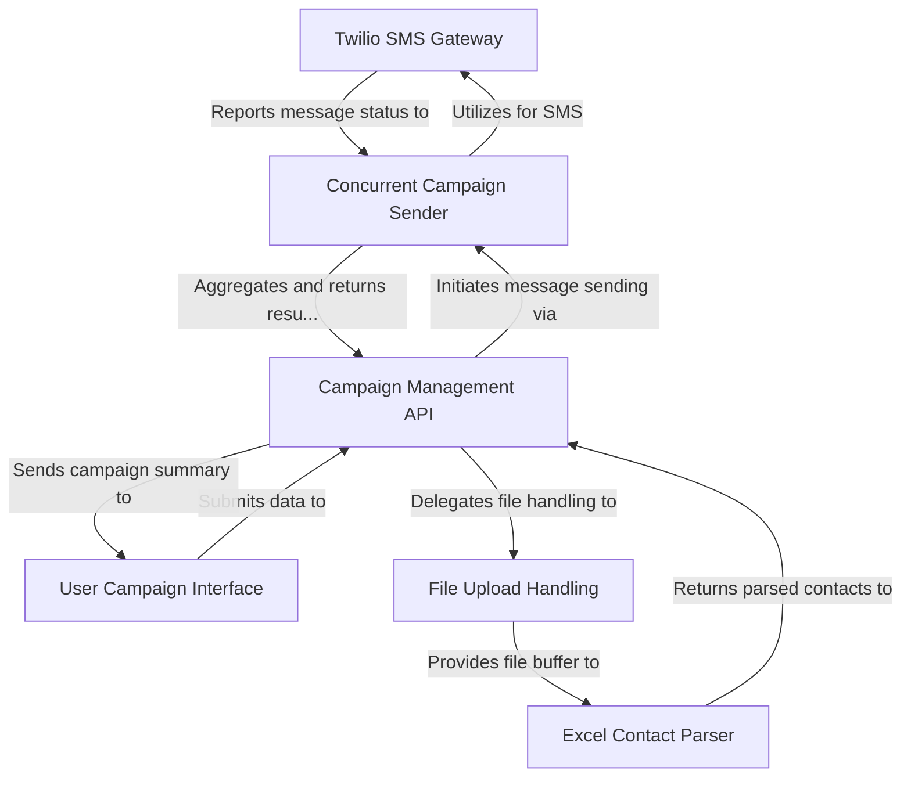

# Tutorial: sms-poc

This project is a simple *web application* designed to help users send **bulk SMS campaigns**. You can easily **upload an Excel file** containing contact details through a friendly *web interface*, type your message, and the system will efficiently send it to all your contacts using the **Twilio SMS service**, providing a summary of sent and failed messages.


**Source Repository:** [None](None)



## Chapters

1. [User Campaign Interface
](01_user_campaign_interface_.md)
2. [Campaign Management API
](02_campaign_management_api_.md)
3. [File Upload Handling
](03_file_upload_handling_.md)
4. [Excel Contact Parser
](04_excel_contact_parser_.md)
5. [Concurrent Campaign Sender
](05_concurrent_campaign_sender_.md)
6. [Twilio SMS Gateway
](06_twilio_sms_gateway_.md)

## Requirements
 Node.js and npm installed on your machine.

 If not installed, download and install from [Node.js official website](https://nodejs.org/).
 
 OR you can watch this [video tutorial](https://youtu.be/NrhP53Divco?si=S4W_noLzo6y5Rya_) for installation guidance.

## Setup Instructions
1. Create a parent directory for the project.
2. Create a subdirectory named `backend` and `frontend` within the parent directory. 
3. Now create a `.env` file in the `backend` directory and add your Twilio credentials:
   ```
   TWILIO_ACCOUNT_SID=your_account_sid
   TWILIO_AUTH_TOKEN=your_auth_token
   SERVICE_SID=your_service_sid
   ```
4. Navigate to the `backend` directory in your terminal and run:
   
   ```
   npm install
   nodemon server.js
   ```   
5. Navigate to the browser and open the 

    ```
    http://localhost:4000
    ```  
---